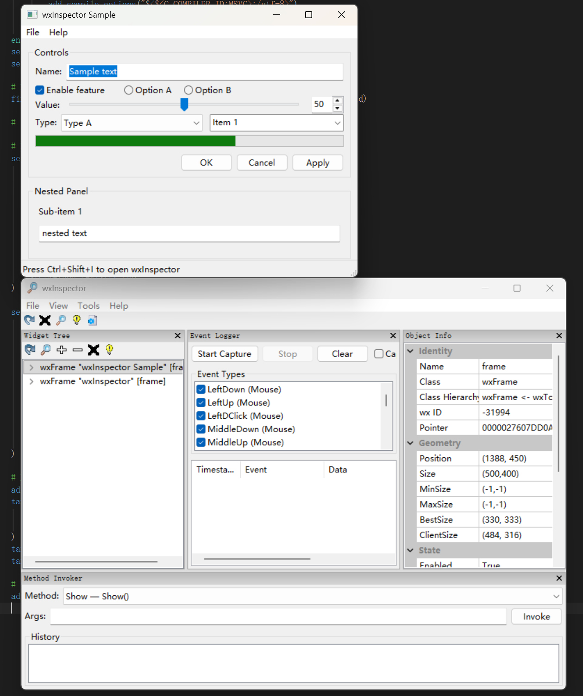

# wxInspector

A C++ widget inspection tool for wxWidgets applications — runtime introspection
of all live widgets and sizers, equivalent to browser DevTools for native GUI apps.

Ported from [wxPython's `wx.lib.inspection`](https://github.com/wxWidgets/Phoenix).



## Features

- **Widget Tree** — hierarchical view of all live windows and sizers
- **Property Grid** — view and edit widget properties in real time
- **Method Invoker** — call methods on selected widgets at runtime
- **Event Logger** — capture and inspect events flowing through a widget
- **Widget Highlighting** — visually highlight widgets and sizer layouts
- **Find Widget** — click on any part of the app to locate the widget

## Requirements

- **wxWidgets** 3.2.0+ (with `aui`, `stc`, `propgrid` components)
- **CMake** 3.16+
- **C++11** compiler

## Quick Start

```cpp
#include <wx/inspector/inspector.h>

class MyApp : public wxApp, public wxInspector::wxInspectable {
    bool OnInit() override {
        SetupInspectorAccelerator(myFrame);
        // ... create your UI ...
        ShowInspector();  // optional, or press Ctrl+Shift+I
        return true;
    }
};
wxIMPLEMENT_APP(MyApp);
```

For modal dialogs, use the same mixin pattern:

```cpp
class SettingsDialog : public wxDialog, public wxInspector::wxInspectable {
    SettingsDialog(wxWindow* parent)
        : wxDialog(parent, "Settings"), wxInspector::wxInspectable()
    {
        SetupInspectorAccelerator(this);
        // ... create dialog UI ...
    }
};
```

## Building

```sh
mkdir build && cd build
cmake .. -DwxWidgets_CONFIG_EXECUTABLE=/path/to/wx-config
cmake --build .
```

## Project Structure

```
wxInspector/
├── include/wx/inspector/   -- Public headers
├── src/                    -- Implementation
├── samples/minimal/        -- Example usage
├── docs/design.md          -- Design specification
├── CMakeLists.txt
└── README.md
```

## License

wxWindows License (same as wxWidgets)
